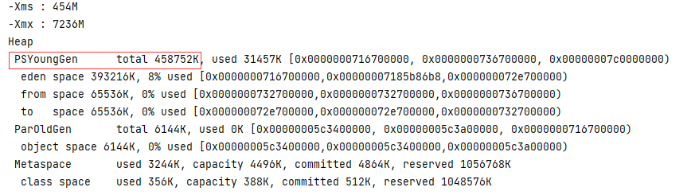

# JVM 常用参数总结
> 本文主要是 [JavaGuide-最重要的JVM参数总结](https://javaguide.cn/java/jvm/jvm-parameters-intro.html) 的阅读实践和记录

## 一、堆内存相关

### 1.1 显示指定堆内存

堆是 Java 虚拟机所管理的内存中最大的一块；根据应用程序需求初始化堆内存也是与性能相关的最常见的实践之一。可以通过以下的 JVM 参数指定堆的大小范围：

``` sh
-Xms<heap size>[unit]
-Xmx<heap size>[unit]
```

* heap size：表示指定的大小
* unit: 表示大小单位，可用单位有 “g”(GB)， “m”(MB), "k"(KB)

### 1.2 显示指定新生代内存

根据 [Oracle 官方文档](https://docs.oracle.com/javase/8/docs/technotes/guides/vm/gctuning/sizing.html)，在堆总可用内存配置完成之后，影响垃圾回收性能的第二大影响因素是为 `Young Generation` 在堆内存所占的比例。默认情况下，YG 的最小大小为 1310 *MB*，最大大小为 *无限制*。 可通过以下方式指定新生代内存的大小：

**1.通过`-XX:NewSize`和`-XX:MaxNewSize`指定**

```sh
-XX:NewSize=<young size>[unit]
-XX:MaxNewSize=<young size>[unit]
```

**2.通过`-Xmn<young size>[unit]`指定**

​	如，为新生代分配 256m 的内存（NewSize 与 MaxNewSize 设为一致），参数写为：

```sh
-Xmn256m
```


除此之外，还可以通过**`-XX:NewRatio=<int>`** 来设置**老年代与新生代**内存的比值, 比如下面的参数就是设置老年代与新生代内存的比值为 1。也就是说老年代和新生代所占比值为 1：1，新生代占整个堆栈的 1/2。
```sh
-XX:NewRatio=1
```

!!! GC调优策略中很重要的一条经验总结
    将新对象预留在新生代，由于 Full GC 的成本远高于 Minor GC，因此尽可能将对象分配在新生代是明智的做法，实际项目中根据 GC 日志分析新生代空间大小分配是否合理，适当通过“-Xmn”命令调节新生代大小，最大限度降低新对象直接进入老年代的情况。

**3.元空间相关参数**

```sh
-XX:MetaspaceSize=N # 触发 Full GC 的阈值大小
-XX:MaxMetaspaceSize=N #设置 Metaspace 的最大大小
```

### 1.3 堆参数实践

这里主要验证参数 `-XX:NewSize` 用来指定新生代内存大小的作用。下面程序会打印堆的内存信息；同时通过设置该程序在 idea 中的运行 Configuration ，添加 `-XX:+PrintGCDetails` 参数打印更详细堆内存分配信息；

```java
public class gcTest {
    public static void main(String[] args) {
        //返回Java虚拟机中的堆内存总量
        long initialMemory = Runtime.getRuntime().totalMemory() / 1024 / 1024;
        //返回Java虚拟机试图使用的最大堆内存量
        long maxMemory = Runtime.getRuntime().maxMemory() / 1024 / 1024;
        System.out.println("-Xms : " + initialMemory + "M");
        System.out.println("-Xmx : " + maxMemory + "M");
    }
}
```


 

然后通过 `-XX:NewSize=256m` 和 `-XX:NewSize=512m` 分别指定新生代内存大小为 256M 和 512M， 运行程序，输出如下：

=== "-XX:NewSize=256m"

    { loading=lazy }

=== "-XX:NewSize=512m"

    { loading=lazy }

前者新生代内存大小为： 229376 / 1024 = 224 M；

后者新生代内存大小为：458752 / 1024 = 448 M;

结果验证，实际新生代分配的内存在两种情况下确实与指定大小接近，至于之间的差异猜测跟 gc 程序的实现有关。

## 文章推荐

* [JVM 参数配置说明 - 阿里云官方文档 - 2022](https://help.aliyun.com/document_detail/148851.html)

* [JVM 内存配置最佳实践 - 阿里云官方文档 - 2022](https://help.aliyun.com/document_detail/383255.html)

* [求你了，GC 日志打印别再瞎配置了 - 思否 - 2022](https://segmentfault.com/a/1190000039806436)

* [一次大量 JVM Native 内存泄露的排查分析（64M 问题） - 掘金 - 2022](https://juejin.cn/post/7078624931826794503)

* [一次线上 JVM 调优实践，FullGC40 次/天到 10 天一次的优化过程 - HeapDump - 2021](https://heapdump.cn/article/1859160)

* [听说 JVM 性能优化很难？今天我小试了一把！ - 陈树义 - 2021](https://shuyi.tech/archives/have-a-try-in-jvm-combat)

* [你们要的线上 GC 问题案例来啦 - 编了个程 - 2021](https://mp.weixin.qq.com/s/df1uxHWUXzhErxW1sZ6OvQ)

* [Java 中 9 种常见的 CMS GC 问题分析与解决 - 美团技术团队 - 2020](https://tech.meituan.com/2020/11/12/java-9-cms-gc.html)

* [从实际案例聊聊 Java 应用的 GC 优化-美团技术团队 - 美团技术团队 - 2017](https://tech.meituan.com/2017/12/29/jvm-optimize.html)


## 参考

[1][JVM堆空间大小的设置（-Xms和-Xmx）和查看](https://blog.csdn.net/u011069294/article/details/107181390)
