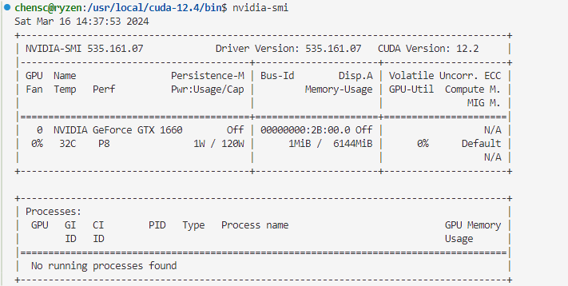
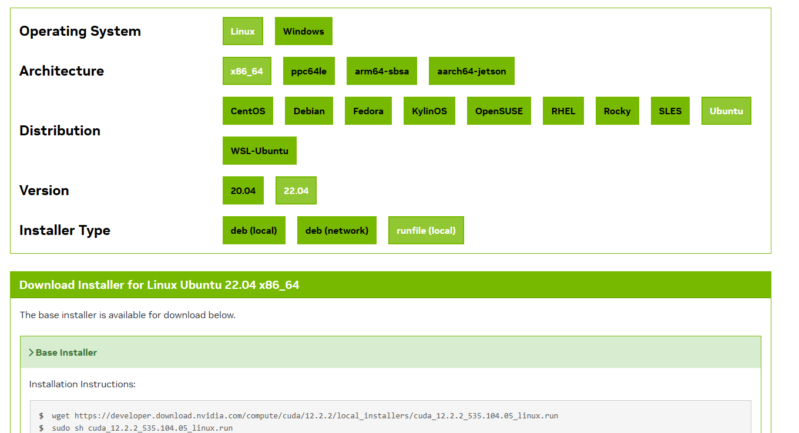
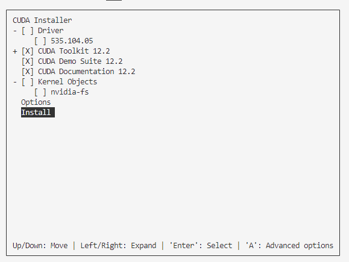
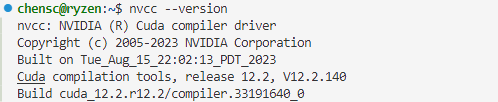

# CUDA error: the provided PTX was compiled with an unsupported toolchain.

>   2024-03-15

解决报错：CUDA error: the provided PTX was compiled with an unsupported toolchain.

问题原因：CUDA Toolkit 与 CUDA 版本不一致

<!-- more -->

## 一、CUDA Toolkit 与 CUDA 版本不一致

### 1. 查看版本信息

------

首先可以通过如下命令查看当前设备上安装的 cuda 版本号和驱动信息：

```shell
nvidia-smi
```

本机的 cuda 版本号为 12.2：



 而 CUDA Toolkit 是用于编写、编译和运行 CUDA C/C++ 程序的软件开发工具包，其版本应与 CUDA 的版本号一致，已经安装过的话，可以听过下面命令查看其对应的 CUDA 版本号：

```shell
nvcc --version
```

这里我的版本为 12.4， 与安装的 CUDA 版本不匹配，所以在运行 CUDA 程序的时候输出如下的报错：

> CUDA error: the provided PTX was compiled with an unsupported toolchain.

### 2. 卸载错误版本的 CUDA ToolKit

------

因此通过下面步骤卸载原来 CUDA Toolkit：

1.执行卸载程序

```
cd /usr/local/cuda-12.4/bin/
sudo ./uninstaller
```

2.删除其他文件（其他博客内容，我这里没有相关的文件）

```shell
sudo apt-get purge --auto-remove nvidia-cuda-toolkit
```

3.删除原来的安装目录(留着也没用)

```
rm -rf /usr/local/cuda-12.4
```

4.打开 ~/.bashrc，删除原来定义 path 信息

```shell
# add nvcc compiler to path
export PATH=$PATH:/usr/local/cuda-12.4/bin
# add cuBLAS, cuSPARSE, cuRAND, cuSOLVER, cuFFT to path
export LD_LIBRARY_PATH=$LD_LIBRARY_PATH:/usr/local/cuda-12.4/lib64:/usr/lib/x86_64-linux-gnu
```

此时通过 `nvcc --version`命令检验，CUDA Toolkit 确实已经删除掉了


### 3. 重新安装 CUDA ToolKit

------

在 [CUDA Toolkit](https://link.zhihu.com/?target=https%3A//developer.nvidia.com/cuda-toolkit) 的下载页面选择对应的cuda版本、系统版本和安装方式，下载并运行 runfile。


下载 CUDA Toolkit

```shell
wget https://developer.download.nvidia.com/compute/cuda/12.2.2/local_installers/cuda_12.2.2_535.104.05_linux.run
```

安装 CUDA Toolkit

```shell
sudo sh cuda_12.2.2_535.104.05_linux.run
```
安装时会输出一下菜单，因为已经安装 driver 了，所以这里取消安装 driver，选择安装



安装完成后会输出如下提示：

```
Please make sure that
 -   PATH includes /usr/local/cuda-12.2/bin
 -   LD_LIBRARY_PATH includes /usr/local/cuda-12.2/lib64, or, add /usr/local/cuda-12.2/lib64 to /etc/ld.so.conf and run ldconfig as root
```

需要修改环境变量 PATH 和 LD_LIBRARY_PATH。在 ~/.bashrc 文件中写入：

```shell
# add nvcc compiler to path
export PATH=$PATH:/usr/local/cuda-12.2/bin
# add cuBLAS, cuSPARSE, cuRAND, cuSOLVER, cuFFT to path
export LD_LIBRARY_PATH=$LD_LIBRARY_PATH:/usr/local/cuda-12.2/lib64:/usr/lib/x86_64-linux-gnu
```

修改完成后使用 source 命令重新编译应用配置文件：

```shell
source ~/.bashrc
```

> 注意事项：
>
> 1. 环境变量 PATH 设置可执行程序的搜索路径，LD_LIBRARY_PATH 设置动态链接库的搜索路径
> 2. CUDA, cuRAND 等动态库均位于 /usr/local/cuda-12.2/lib64 路径中。在 CUDA 10.0 以前，cuBLAS 也位于此路径下，但在 CUDA 10.1 中，cuBLAS 被[迁移](https://link.zhihu.com/?target=https%3A//devtalk.nvidia.com/default/topic/1047981/cuda-setup-and-installation/cublas-for-10-1-is-missing/)到了 /usr/lib/x86_64-linux-gnu 中。

此时安装结束，可以查看版本号查看结果，安装成功。


### 4. 验证 NVCC 编译结果

通过重新安装的 nvcc 编译器重新编译此前的 CUDA 程序，执行，输出如下，问题解决：

```shell
CUDA error: no error
COMPLETED SUCCESSFULLY
```


[1] [Linux 下的 CUDA 安装和使用指南](https://zhuanlan.zhihu.com/p/79059379) </br>
[2] [CUDA编程入门极简教程](https://zhuanlan.zhihu.com/p/34587739) </br>
[3] [更简单的 CUDA 简介](https://developer.nvidia.com/blog/even-easier-introduction-cuda/)</br>
