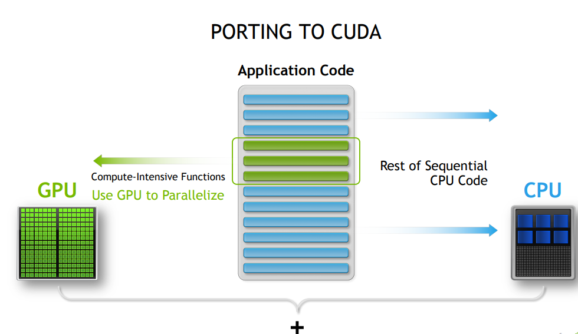
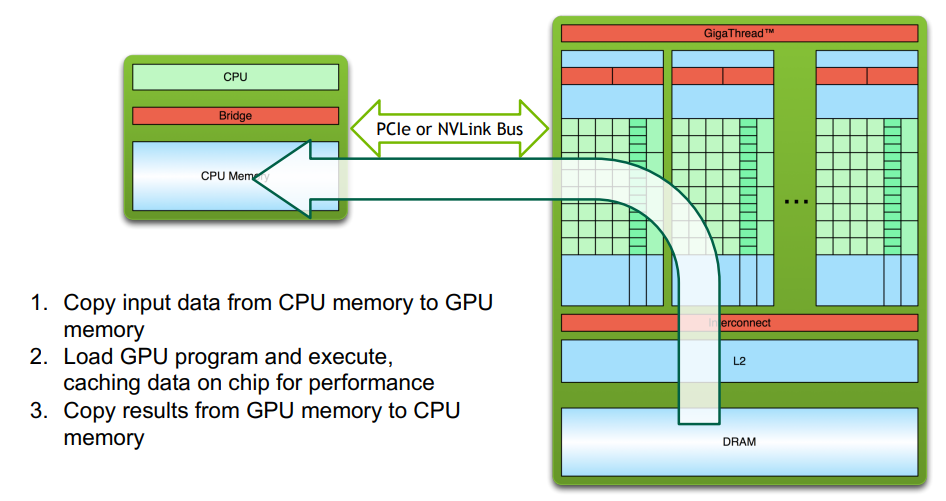
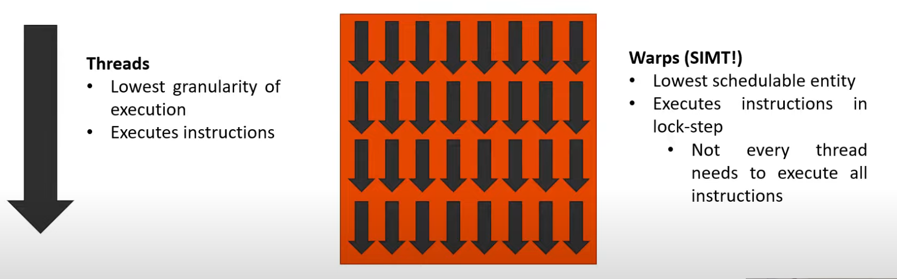
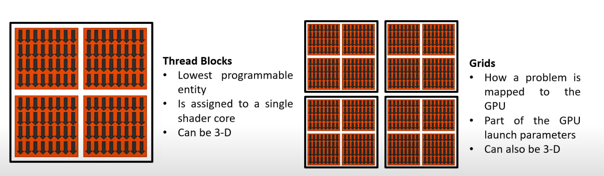
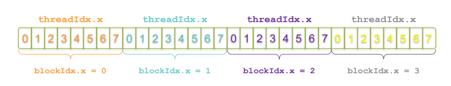
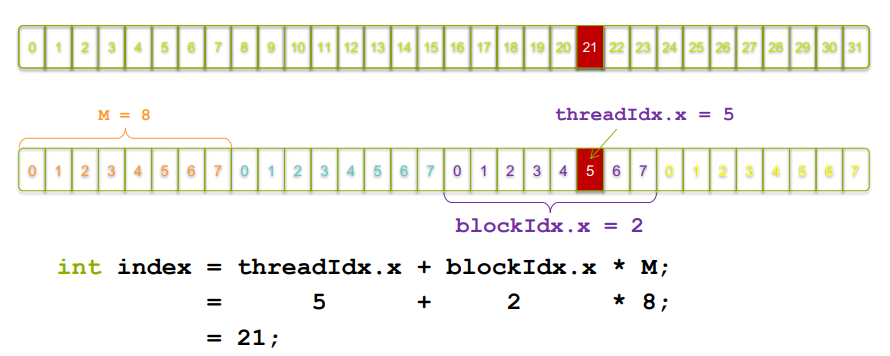

# CUDA 编程（一）

>   2024-03-18

!!! 摘要

	1.cuda 编程模型基本概念 
	
	2.cuda C++ 基本 api
	
	3.并行向量加法实现
	
	4.并行向量乘法实现


<!-- more -->

## 一、基本概念

CUDA（Compute Unified Device Architecture）是由NVIDIA开发的并行计算平台和编程模型。该编程模型是一个异构模型，需要 CPU 和 GPU 协同工作，以下为该编程模型的重要概念

* **Host** : CPU 及其内存
* **Device** : GPU 及其内存

Host 和 Device 硬件架构不同，各自拥有独立的物理内存空间，CUDA 应用程序也由 Host 代码 和 Device 代码组成：



注意，因为两者内存空间独立，因此当程序在两者之间转换执行时，需要进行数据迁移，切换的基本流程为：



* **Kernel** : 在 Device 的线程中并行执行的函数
* **Thread** ：线程，最小的执行单元
* **Warps**：线程束，最小的分配单元，包含  32 个线程
* **Block**：线程块，最小的可编程实体
* **Grid**：网格，由线程块组成


上面四个概念的范围由小到大，其中也涉及到 GPU 的硬件构造：

1. kernel 在 device 上执行时实际上是启动很多线程并行执行，一个 kernel 所启动的所有线程称为一个**网格(Grid)**，同一个网格上的线程共享相同的全局内存空间，而网格又可以分为很多**线程块(Block)**，一个线程块里面又包含很多线程。
2. GPU硬件的一个核心组件是 **SM（Streaming Multiprocessor, 流式多处理器）**，采用的是SIMT(Single-Instruction, Multiple-Thread，单指令多线程) 架构，**基本的执行单元是线程束**，包含32个线程。这些线程同时执行相同的指令，但是每个线程都包含自己的指令地址计数器和寄存器状态，也有自己独立的执行路径。所以尽管线程束中的线程同时从同一程序地址执行，但是可能具有不同的行为，比如遇到了分支结构，一些线程可能进入这个分支，但是另外一些有可能不执行，它们只能死等，因为GPU规定线程束中所有线程在同一周期执行相同的指令，线程束分化会导致性能下降。
3. 线程块被分配到SM上，一个线程块只能在一个SM上被调度，SM一般可以调度多个线程块。由于SM的基本执行单元是包含32个线程的线程束，所以block大小一般要设置为32的倍数。
4. 每个线程有自己的私有 **本地内存(Local Memory)**，而每个线程块有包含 **共享内存(Shared Memory)**可以被线程块中所有线程共享，其生命周期与线程块一致。此外，所有的线程都可以访问 **全局内存(Global Memory)**

<figure class="figure-image" style="width:50%;">
  
  <figcaption>CUDA 内存模型</figcaption>
</figure>


Kernel 的线程由 Grid 和 Block 划分为两个逻辑上层次结构，这两个层次可以灵活地定义为1-dim，2-dim以及3-dim结构，下面是一个 Grid 和 Block 都是两维，为以下结构的示例（可以看作坐标系水平方向为 x 轴，y 轴竖直向下）

```c++
dim3 grid(3, 2);
dim3 block(5, 3);
```


<figure class="figure-image" >
  
  <figcaption>Kernel上的两层线程组织结构（2-dim）</figcaption>
</figure>

据此可以对 Grid 中的每个线程可以根据两个内置的坐标变量（blockIdx，threadIdx）进行唯一标识，这两个变量 `dim3` 类型的变量，其中 blockIdx 指明线程所在 Grid 中的位置，而 threaIdx 指明线程所在 block 中的位置，如图中的 Thread (1,1)满足：

```c++
// 所处的 block 在 grid 中的位置
blockIdx.x = 1
blockIdx.y = 1
// 自身在 block 中的位置
threadIdx.x = 1
threadIdx.y = 1
```


## 二、CUDA C++ 基本 API

* **`__global__` 关键字**

该关键字标识该函数将在 device 上执行；它可以从 host 代码或者其他 device 代码中调用。

NVCC将源代码分成 host 和 device 两部分，NVIDIA 编译器处理的 device 函数 （例如mykernel () )，而 host 函数由标准编译器处理（例如main ()）:

```c++

__global__ void mykernel(void) {
    ...
}
```

* **`mykernel<<<1,1>>>();`**

三尖括号标记对 device 代码的调用，也称内核启动（kernel launch）；三尖括号内的参数是 CUDA 内核配置参数，对应 Grid 和 Block 的结构。这里即只有一个 block, block 里只有一个线程。

* **`blockIdx ` 和 `threadIdx`** 

三维变量，分别用于获取线程在grid 和 block 中的位置。

* **Device 的基本内存管理**

```c++
\\ 在 device 上分配内存
cudaMalloc((void **)&d_a, size);
\\ 将数据从 host 内存拷贝到 device 内存
cudaMemcpy(d_a, a, size, cudaMemcpyHostToDevice);
\\ 释放 device 内存
cudaFree(d_a); 
```

其中 `cudaMemcpy` 拷贝数据的方向，可由最后一个参数指定，取值可为：

>- **cudaMemcpyHostToDevice**：从主机内存复制到设备内存。
>- **cudaMemcpyDeviceToHost**：从设备内存复制到主机内存。
>- **cudaMemcpyDeviceToDevice**：在设备内存之间进行复制。
>- **cudaMemcpyHostToHost**：在主机内存之间进行复制。


## 三、并行向量加法实现

两向量相加，即将两向量对应位置上的元素相加，与其他位置数据不相关，非常适合进行并行化除处理；下面直接给出代码：

```c++
#include <iostream>
#include <math.h>

#define N (2048*2048)
#define THREADS_PER_BLOCK 512

__global__ void add(int *a, int *b, int *c, int n) {
    int index = threadIdx.x + blockIdx.x * blockDim.x;
    if (index < n)
    	c[index] = a[index] + b[index];
}

int main(void) {
    int *a, *b, *c; // host copies of a, b, c
    int *d_a, *d_b, *d_c; // device copies of a, b, c
    int size = N * sizeof(int);

    // Alloc space for device copies of a, b, c
    cudaMalloc((void **)&d_a, size);
    cudaMalloc((void **)&d_b, size);
    cudaMalloc((void **)&d_c, size);

    // Alloc space for host copies of a, b, c and setup input values
    a = (int *)malloc(size); random_ints(a, N);
    b = (int *)malloc(size); random_ints(b, N);
    c = (int *)malloc(size);

    // Copy inputs to device
    cudaMemcpy(d_a, a, size, cudaMemcpyHostToDevice);
    cudaMemcpy(d_b, b, size, cudaMemcpyHostToDevice);

    // Launch add() kernel on GPU
    add<<<(N + M-1) / M,M>>>(d_a, d_b, d_c, N);

    // Copy result back to host
    cudaMemcpy(c, d_c, size, cudaMemcpyDeviceToHost);
    
    // Cleanup
    free(a); free(b); free(c);
    cudaFree(d_a); cudaFree(d_b); cudaFree(d_c);
    return 0;
}

```


上面代码有以下实现细节：

1.`__global__` 函数中 index 的计算

```c++
__global__ void add(int *a, int *b, int *c, int n) {
    int index = threadIdx.x + blockIdx.x * blockDim.x;
    if (index < n)
    	c[index] = a[index] + b[index];
}
```

* 前面提到 kernel 函数将在多个线程中同时执行，也即程序并行计算的部分。对于向量加法的案例，每个线程负责将两个向量某一对应位置的数相加，因此，这里通过每个线程在 grid 中的唯一 ID 来映射到向量的 index，从而使得每个线程都能找到自己负责的数据进行计算。
  
  

* `if (index < n)` 判断排除访问到越界数据，因为 device 上实际运行的线程数量可能多于向量的 size (因为最小的分配单元式线程束，32个线程)

2.调用 device 代码时 grid 维度的计算

```c++
 add<<<(N + M-1) / M,M>>>(d_a, d_b, d_c, N);
```

这里 block 数量的计算方法为 (N + M -1) / M 而不是 N / M 是考虑当 N 不是 M 的倍数时，向上取整，否则实际启动的线程数将少于需要的线程数。


## 四、并行向量乘法实现

直接上代码，其中有一下地方值得借鉴：

* CUDA 错误检测：每个CUDA运行时 API 调用都会返回一个错误代码。严格检查这些错误代码是一种很好的做法(尤其是在遇到麻烦的时候)。给出的宏将使这项工作更容易。请注意内核调用后的特殊错误检查方法。

```c++
#include <stdio.h>

// these are just for timing measurments
#include <time.h>

// error checking macro
#define cudaCheckErrors(msg) \
    do { \
        cudaError_t __err = cudaGetLastError(); \
        if (__err != cudaSuccess) { \
            fprintf(stderr, "Fatal error: %s (%s at %s:%d)\n", \
                msg, cudaGetErrorString(__err), \
                __FILE__, __LINE__); \
            fprintf(stderr, "*** FAILED - ABORTING\n"); \
            exit(1); \
        } \
    } while (0)


const int DSIZE = 4096;
const int block_size = 16;  // CUDA maximum is 1024 *total* threads in block
const float A_val = 1.0f;
const float B_val = 2.0f;

// matrix multiply (naive) kernel: C = A * B
__global__ void mmul(const float *A, const float *B, float *C, int ds) {

  int idx = threadIdx.x+blockDim.x*blockIdx.x; // create thread x index 行
  int idy = threadIdx.y+blockDim.y*blockIdx.y; // create thread y index 列

  if ((idx < ds) && (idy < ds)){
    float temp = 0;
    for (int i = 0; i < ds; i++)
      temp += A[idx*ds+i] * B[i*ds+idy];   // dot product of row and column
    C[idy*ds+idx] = temp;
  }
}

int main(){

  float *h_A, *h_B, *h_C, *d_A, *d_B, *d_C;

  // these are just for timing
  clock_t t0, t1, t2;
  double t1sum=0.0;
  double t2sum=0.0;

  // start timing
  t0 = clock();

  h_A = new float[DSIZE*DSIZE];
  h_B = new float[DSIZE*DSIZE];
  h_C = new float[DSIZE*DSIZE];
  for (int i = 0; i < DSIZE*DSIZE; i++){
    h_A[i] = A_val;
    h_B[i] = B_val;
    h_C[i] = 0;}

  // Initialization timing
  t1 = clock();
  t1sum = ((double)(t1-t0))/CLOCKS_PER_SEC;
  printf("Init took %f seconds.  Begin compute\n", t1sum);

  // Allocate device memory and copy input data over to GPU
  cudaMalloc(&d_A, DSIZE*DSIZE*sizeof(float));
  cudaMalloc(&d_B, DSIZE*DSIZE*sizeof(float));
  cudaMalloc(&d_C, DSIZE*DSIZE*sizeof(float));
  cudaCheckErrors("cudaMalloc failure");
  cudaMemcpy(d_A, h_A, DSIZE*DSIZE*sizeof(float), cudaMemcpyHostToDevice);
  cudaMemcpy(d_B, h_B, DSIZE*DSIZE*sizeof(float), cudaMemcpyHostToDevice);
  cudaCheckErrors("cudaMemcpy H2D failure");

  // Cuda processing sequence step 1 is complete

  // Launch kernel
  dim3 block(block_size, block_size);  // dim3 variable holds 3 dimensions
  dim3 grid((DSIZE+block.x-1)/block.x, (DSIZE+block.y-1)/block.y);
  mmul<<<grid, block>>>(d_A, d_B, d_C, DSIZE);
  cudaCheckErrors("kernel launch failure");

  // Cuda processing sequence step 2 is complete

  // Copy results back to host
  cudaMemcpy(h_C, d_C, DSIZE*DSIZE*sizeof(float), cudaMemcpyDeviceToHost);

  // GPU timing
  t2 = clock();
  t2sum = ((double)(t2-t1))/CLOCKS_PER_SEC;
  printf ("Done. Compute took %f seconds\n", t2sum);

  // Cuda processing sequence step 3 is complete

  // Verify results
  cudaCheckErrors("kernel execution failure or cudaMemcpy H2D failure");
  for (int i = 0; i < DSIZE*DSIZE; i++) if (h_C[i] != A_val*B_val*DSIZE) {printf("mismatch at index %d, was: %f, should be: %f\n", i, h_C[i], A_val*B_val*DSIZE); return -1;}
  printf("Success!\n"); 

  return 0;
}
```


## 参考资料

[1] [CUDA编程入门极简教程](https://zhuanlan.zhihu.com/p/34587739) </br>

[2] [CUDA-统一内存](https://zhuanlan.zhihu.com/p/567915643)<br>
