# 第一章 递归函数

!!! 摘要
    本原函数类: $\mathcal{IF}$  
    初等函数类：$\mathcal{EF}$  
    原始递归函数类: $\mathcal{PRF}$  
    原始复迭函数类：$\mathcal{ITF}$

## 初等函数
------
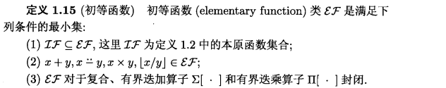
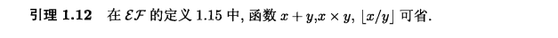
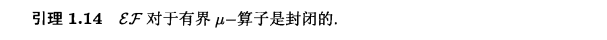

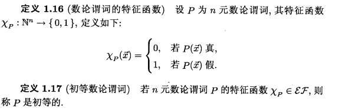
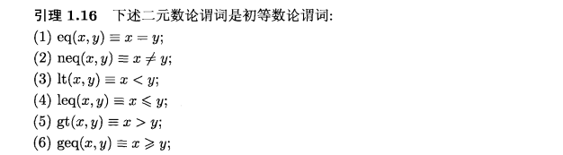
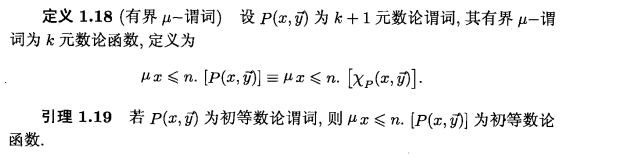

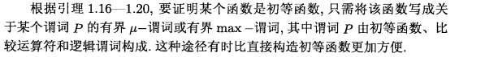
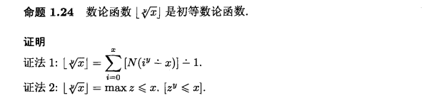
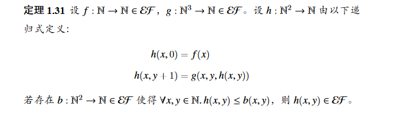
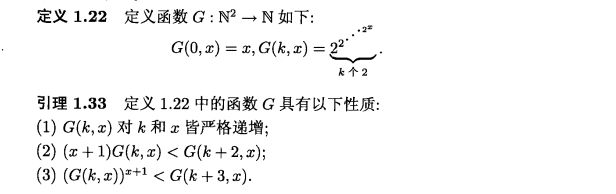
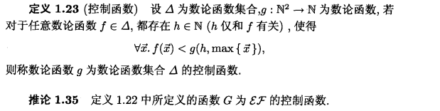

## 原始递归函数
------
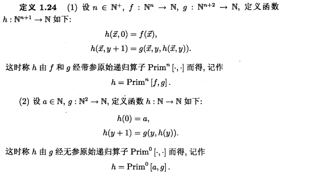
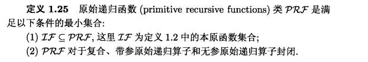
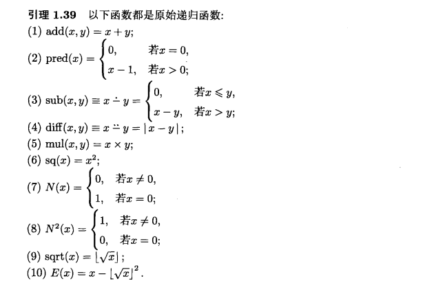
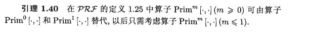

------
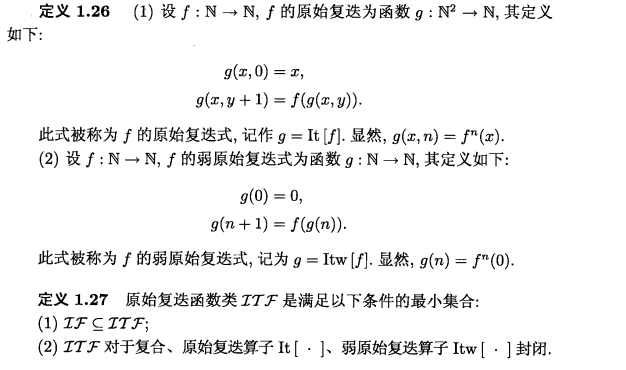

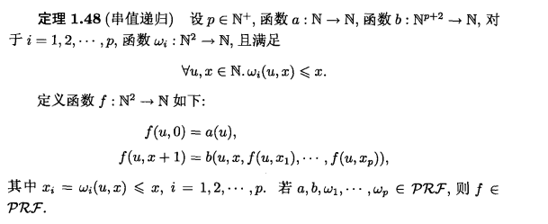
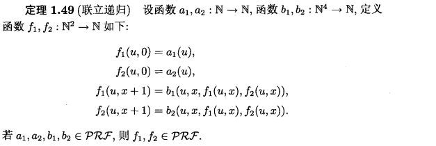
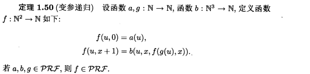
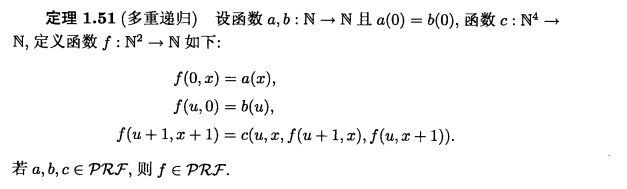
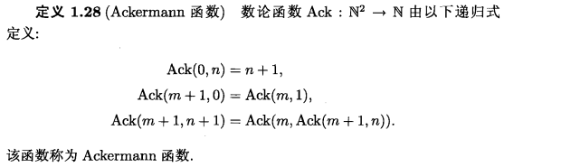
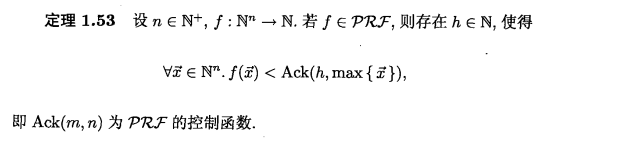

## 递归函数
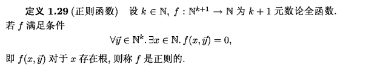
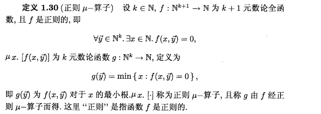

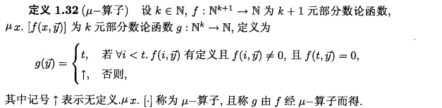
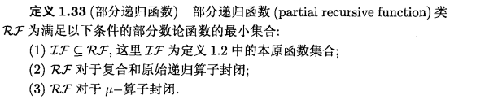
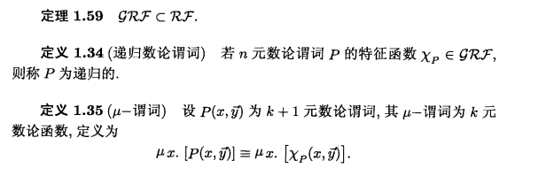
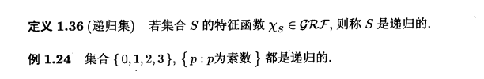

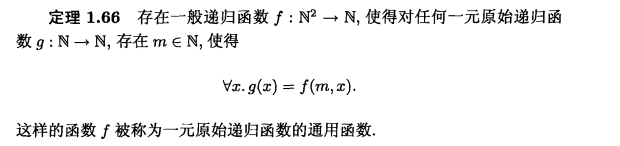

## 结论

